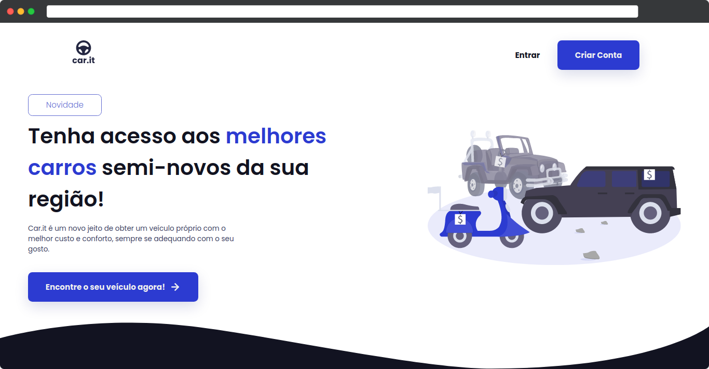

<h1>Car.it o melhor marketplace de automóveis</h1>

# Documentação

**Are you about to download this project for the first time?**

Here's a guide to set up this in your machine:

1. To install node_modules with all dependecies run: `npm i`
2. To run this project you must use the command: `npm run dev`

------

**Important things to know before contributing to this project:**

- Every component has it's own stylesheet in the same folder which is the index page, and the name of the style file must be `style.module.scss`
- There are SASS variables ready to be used, so make a good use of them

------

## Index

| Themes                                               | Link                      |
| ---------------------------------------------------- | ------------------------- |
| Wanna know how does this project's components works? | [Click here](#Components) |

## Components

### Title

The `<Title></Title>` component accepts the following properties:

| Propertie | **Type**  | Description                                    | Optional | Image |
| --------- | --------- | ---------------------------------------------- | -------- | ----- |
| `white`   | `boolean` | If true changes the color of the text to white | Yes      |       |
| `center`  | `boolean` | If true changes the text alignment to center   | Yes      |       |

------

### Text

The `<Text></Text>` component accepts the following properties:

| Propertie | **Type**  | Description                                    | Optional |
| --------- | --------- | ---------------------------------------------- | -------- |
| `white`   | `boolean` | If true changes the color of the text to white | Yes      |

------

### Logo

The `<Logo></Logo>` component accepts the following properties:

| Propertie | **Type**  | Description                                    | Optional |
| --------- | --------- | ---------------------------------------------- | -------- |
| `white`   | `boolean` | If true changes the color of the text to white | Yes      |

------

### Box

The `<Box></Box>` is basically a card that gets whatever you put into it and display it with a `box-shadow` and `padding` around it.

------

### Button

The `<Button></Button>` component accepts the following properties:

| Propertie    | **Type**  | Description                                                  | Required |
| ------------ | --------- | ------------------------------------------------------------ | -------- |
| `href`       | `string`  | It is the required path to redirect the user to the page you want | `true`   |
| `secondary`  | `boolean` | If true mainly sets the background color to white, others changes can be searched in it's style file | `false`  |
| `fillParent` | `boolean` | If true makes the component fill parents `width`             | `false`  |
| `facebook`   | `boolean` | If true returns the Facebook form button                     | `false`  |
| `google`     | `boolean` | If true returns the Google form button                       | `false`  |
| `spacer`     | `boolean` | If true creates a spacer after the button                    | `false`  |

------
